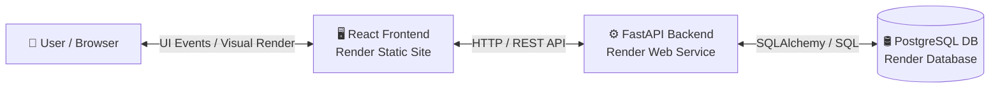
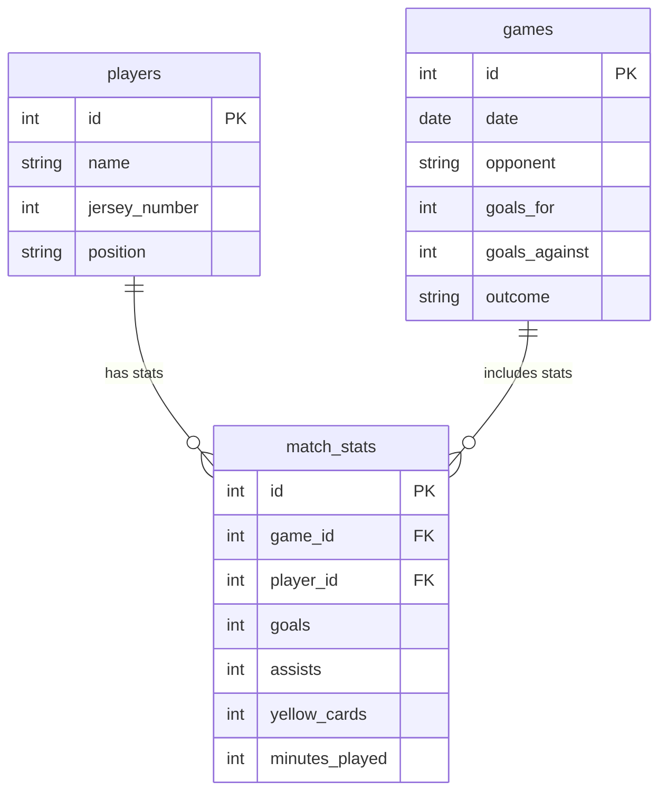

# ⚽ Soccer Stat Keeper


> A full-stack web application designed for soccer teams to track player performance, match outcomes, and season statistics.

🚀 **Live Demo:** [soccer-stat-keeper-fe.onrender.com](https://soccer-stat-keeper-fe.onrender.com)  
📖 **Interactive API Docs:** [soccer-stat-keeper.onrender.com/docs](https://soccer-stat-keeper.onrender.com/docs)

> 💡 *Note: The live site is hosted on Render's free tier. If the service has been idle, the backend web service may take ~30 seconds to wake up and return data on your initial visit.*

---

## ✨ Features

* **Roster Management:** Create and update player profiles with positions and jersey numbers.
* **Match Tracking:** Record match dates, opponents, goals scored, goals conceded, and match outcomes.
* **Granular Player Stats:** Log per-game individual metrics including goals, assists, yellow cards, and minutes played.
* **Relational Data Integrity:** Automated updates and cascading deletes on stats when players or games are removed.
* **Interactive API Documentation:** Built-in Swagger UI generated automatically by FastAPI for testing endpoints.

---

## 🏗️ System Architecture

This application uses a modern full-stack decoupled architecture deployed on Render's cloud platform.



### Tech Stack

* **Frontend:** React (Vite), TypeScript, Tailwind CSS
* **Backend:** Python 3.10+, FastAPI, Pydantic, Uvicorn
* **Database & ORM:** PostgreSQL, SQLAlchemy (Core & ORM)
* **Hosting Platform:** Render (Static Site, Web Service, Managed PostgreSQL)

---

## 🛢️ Database Schema (ERD)



---

## 🛠️ Local Setup & Development

### Prerequisites
* **Node.js** (v18+)
* **Python** (v3.10+)
* **PostgreSQL** installed locally (e.g., via Homebrew on macOS)

### 1. Database Setup (macOS)

Start PostgreSQL server:
```bash
brew services start postgresql@14
```

Create local database:
```bash
createdb soccer_stats
```

*(To stop PostgreSQL later: `brew services stop postgresql@14`)*

---

### 2. Backend Setup

Navigate to the backend directory:
```bash
cd backend
```

Create and activate virtual environment:
```bash
python3 -m venv .venv
source .venv/bin/activate
```

Install dependencies:
```bash
pip install -r requirements.txt
```

Create a `.env` file in `backend/`:
```env
DATABASE_URL=postgresql://localhost/soccer_stats
FRONTEND_URL=http://localhost:5173
```

Run development server:
```bash
uvicorn main:app --reload
```
*Backend API runs at `http://localhost:8000`*  
*Swagger Docs available at `http://localhost:8000/docs`*

---

### 3. Frontend Setup

Navigate to the frontend directory:
```bash
cd frontend
```

Install dependencies:
```bash
npm install
```

Create a `.env` file in `frontend/`:
```env
VITE_API_BASE_URL=http://localhost:8000
```

Start Vite dev server:
```bash
npm run dev
```
*Frontend runs at `http://localhost:5173`*

### 4. Running Backend Tests

From the repository root, activate the backend virtual environment and run:
```bash
source .venv/bin/activate
pytest backend/tests -q
```

### 5. Running Frontend Tests

From the frontend directory, run:
```bash
cd frontend
npm run test
```

To generate a coverage report:
```bash
cd frontend
npm run test:coverage
```
The report is written to `frontend/coverage/`.

---

## 💡 Useful Local Database Commands

* Access PostgreSQL shell:
  ```bash
  psql soccer_stats
  ```
* Check PostgreSQL service status:
  ```bash
  brew services list
  ```
* Reset local database:
  ```bash
  dropdb soccer_stats
  createdb soccer_stats
  ```